# Forge 60

Forge 60 is an open hardware DIY flashlight project built around a constant 60 W / 10,000 lm output mode, a high-current driver board, a 5050 LED board, active cooling, and a USB-C charge/discharge power path. It is designed as a reproducible kit: builders can manufacture the PCBs, source parts from the BOM, assemble the electronics and mechanical parts, flash the firmware, and modify the design.

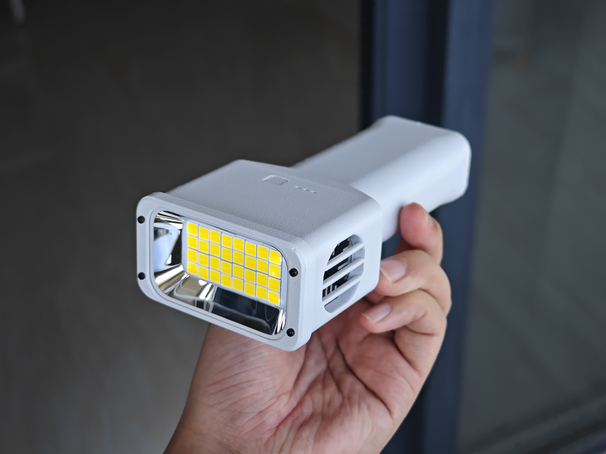

## Highlights

- Constant 60 W high-output flashlight platform
- About 10,000 lm output, depending on LED selection and thermal setup
- 45 W USB-C charging and discharging
- Around one hour full-charge time
- Active cooling with a 30 x 30 x 50 mm heatsink and 3010 fan
- 2S 21700 battery pack architecture
- Open PCB manufacturing files, BOM, pick-and-place files, schematics, and EasyEDA Pro source
- Licensed under CERN-OHL-P-2.0 for permissive open hardware reuse

## Performance Reference

| Mode | Runtime |
| --- | --- |
| 60 W | About 27 minutes |
| 30 W | About 54 minutes |
| 3 W | About 8 hours |

These figures are reference values from the project build. Final performance depends on LED bin, cells, protection board, wiring, cooling quality, firmware, and assembly.

## Specifications

| Item | Value |
| --- | --- |
| Project name | Forge 60 |
| Type | High-power DIY flashlight |
| Maximum power | 60 W |
| Optical output | About 10,000 lm |
| USB-C power | About 45 W charging / discharging |
| Battery architecture | 2S 21700 lithium battery pack |
| Recommended cells | High-drain 21700 cells, such as JP40 / 40PL / 45D class cells |
| Mainboard thickness | 1.0 mm |
| LED board thickness | 1.6 mm |
| Cooling | 30 x 30 x 50 mm heatsink + 3010 fan |
| Hardware license | CERN-OHL-P-2.0 |

## Photos

| Product | Product | Product |
| --- | --- | --- |
|  | 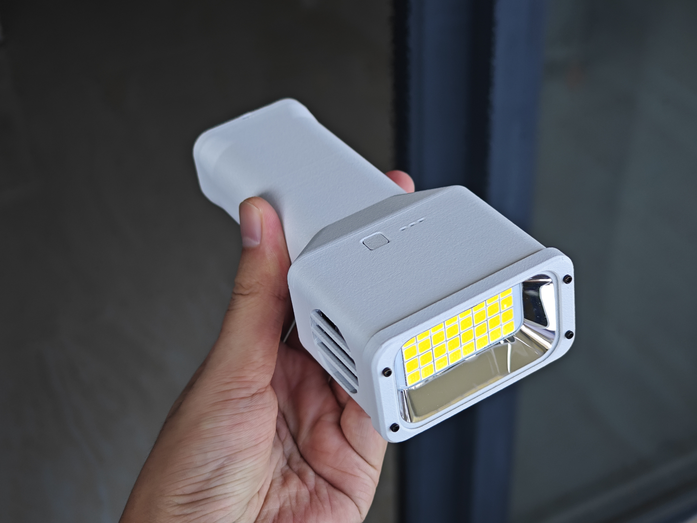 | 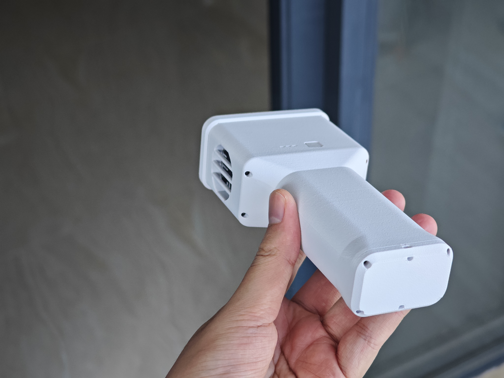 |

## Hardware Downloads

Gerber files are for PCB fabrication. BOM files are for sourcing. Pick-and-place files are for SMT assembly. The EasyEDA Pro source project is provided for editing and modification.

| Board | Gerber | BOM | Pick and Place | Schematic | PCB Preview |
| --- | --- | --- | --- | --- | --- |
| Mainboard v2 | [ZIP](forge60-hardware-release/mainboard-v2/mainboard-v2-gerber.zip) | [XLSX](forge60-hardware-release/mainboard-v2/mainboard-v2-bom.xlsx) / [CSV](forge60-hardware-release/mainboard-v2/mainboard-v2-bom.csv) | [XLSX](forge60-hardware-release/mainboard-v2/mainboard-v2-pick-and-place.xlsx) / [CSV](forge60-hardware-release/mainboard-v2/mainboard-v2-pick-and-place.csv) | [PDF](forge60-hardware-release/mainboard-v2/mainboard-v2-schematic.pdf) | [PDF](forge60-hardware-release/mainboard-v2/mainboard-v2-pcb-preview.pdf) |
| 5050 LED Board | [ZIP](forge60-hardware-release/led-board-5050/led-board-5050-gerber.zip) | [XLSX](forge60-hardware-release/led-board-5050/led-board-5050-bom.xlsx) / [CSV](forge60-hardware-release/led-board-5050/led-board-5050-bom.csv) | [XLSX](forge60-hardware-release/led-board-5050/led-board-5050-pick-and-place.xlsx) / [CSV](forge60-hardware-release/led-board-5050/led-board-5050-pick-and-place.csv) | [PDF](forge60-hardware-release/led-board-5050/led-board-5050-schematic.pdf) | [PDF](forge60-hardware-release/led-board-5050/led-board-5050-pcb-preview.pdf) |

## Source Project

| Format | Download |
| --- | --- |
| EasyEDA Pro source | [forge60-easyeda-pro-source.epro2](forge60-hardware-release/source/forge60-easyeda-pro-source.epro2) |

## PCB Preview

| Mainboard v2 | 5050 LED Board |
| --- | --- |
| 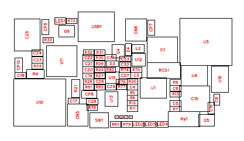 | 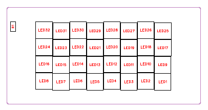 |

## Schematic Preview

| Mainboard v2 | 5050 LED Board |
| --- | --- |
| 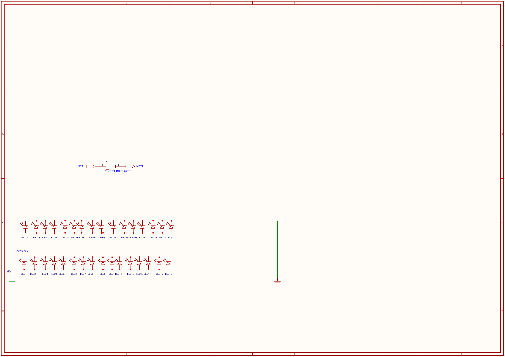 | 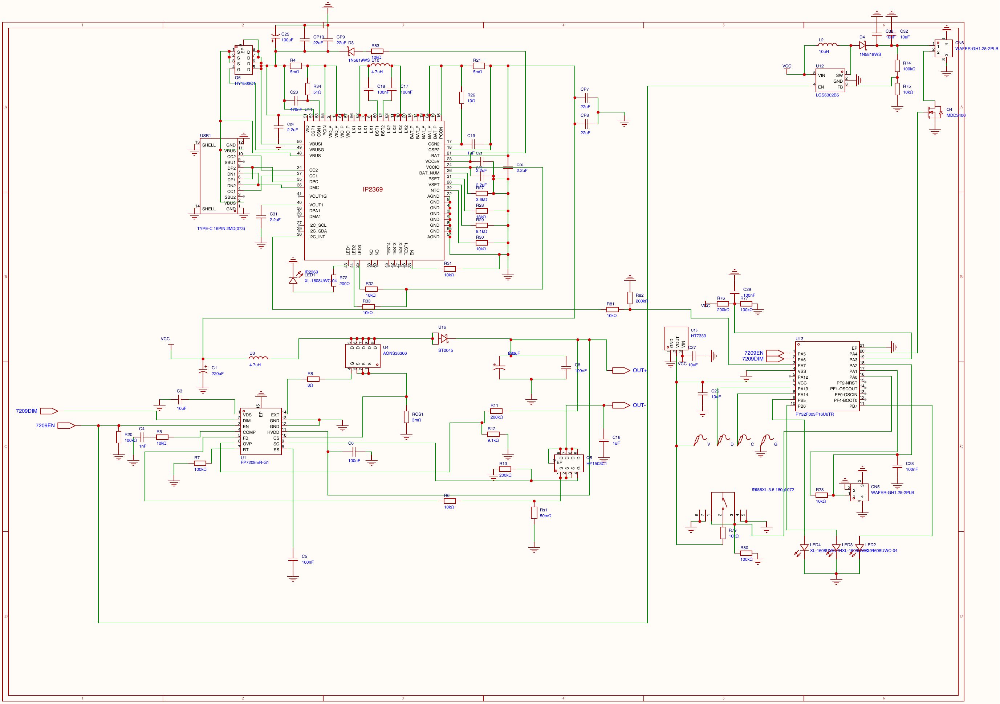 |

## Bill of Materials Overview

The full BOM is provided in the hardware download table. Major parts include:

- IP2369 charge/discharge controller
- FP7209 LED driver controller
- PY32F003 series MCU
- 5050 6 V LEDs, 5000 K / 5700 K recommended
- 2S protection board, 13 A class recommended
- High-drain 21700 cells, such as JP40 / 40PL / 45D class cells
- 30 x 30 x 50 mm heatsink
- 3010 cooling fan
- 74 mm protective glass
- XT30 male/female connectors
- GH1.25 2P cables
- 20 AWG and 16 AWG flexible silicone wires
- M1.4 and M1.7 heat-set inserts
- Matching hex screws and self-tapping screws
- Reflective film, thermal tape, thermal grease, shock-absorbing foam, and high-temperature tape

## Required Tools

- 3D printer
- Spot welder
- Hot plate or hot air station
- Soldering iron
- PWLINK2 LITE programmer
- 1.25 mm programming probe
- Glass cutter, if cutting the protective glass manually
- H1.3 / H1.5 hex drivers

## Firmware Flashing

Use PWLINK2 LITE and select the PY32F003xx6 series target in the programming software. Pay close attention to the V and G pads on the mainboard. Reversed programming probe wiring can damage the board.

| Select MCU | Add firmware | Apply firmware |
| --- | --- | --- |
| 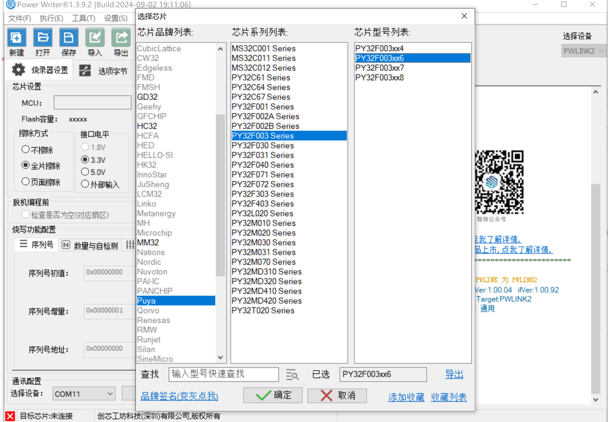 | 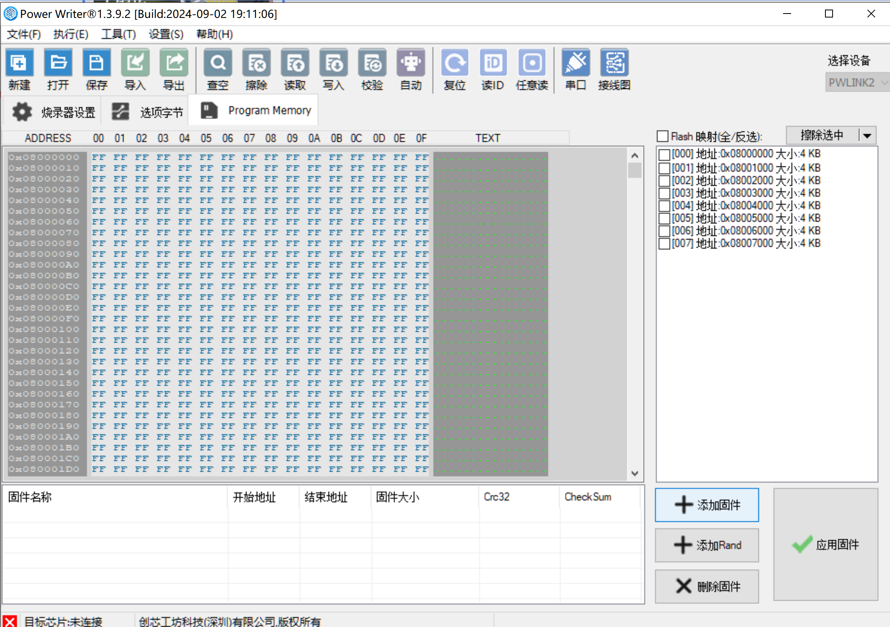 | 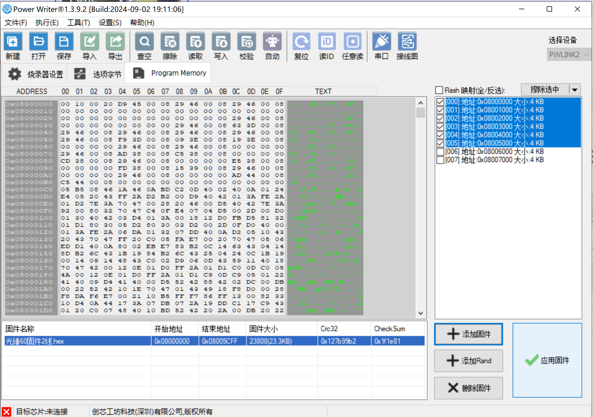 |

| Probe wiring | Mainboard pads | Program complete |
| --- | --- | --- |
| 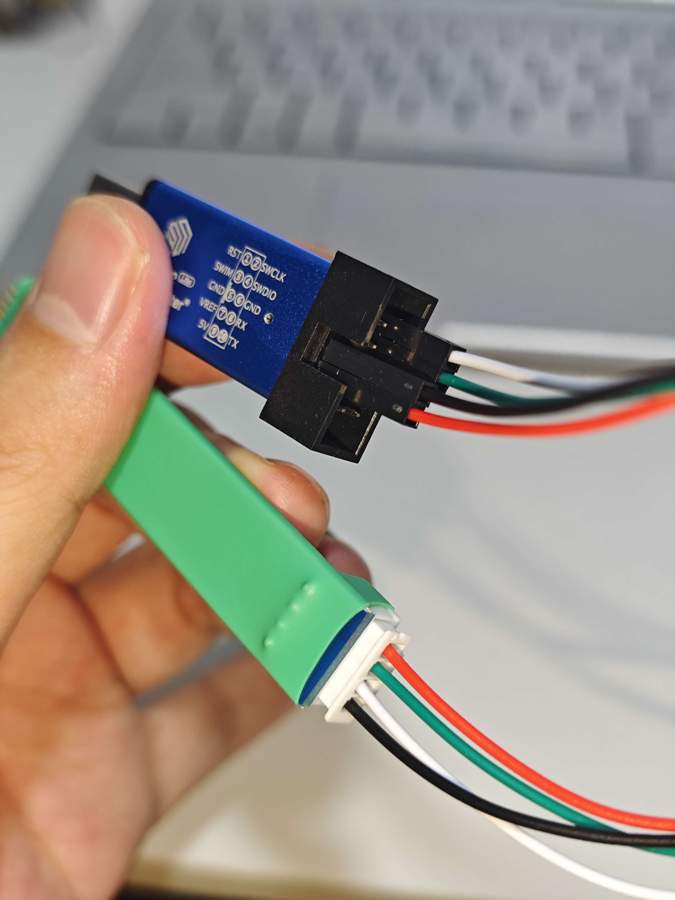 | 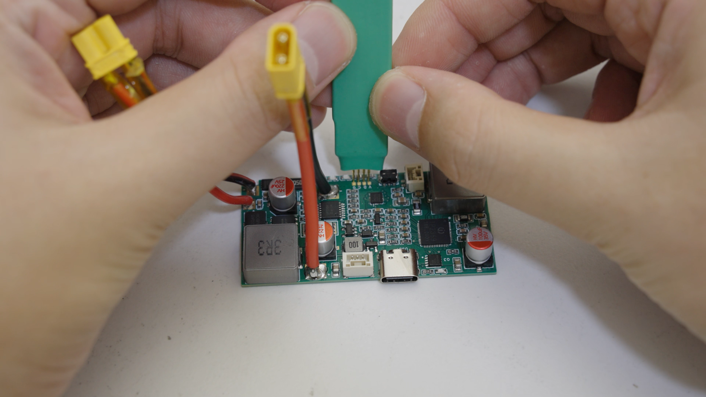 | 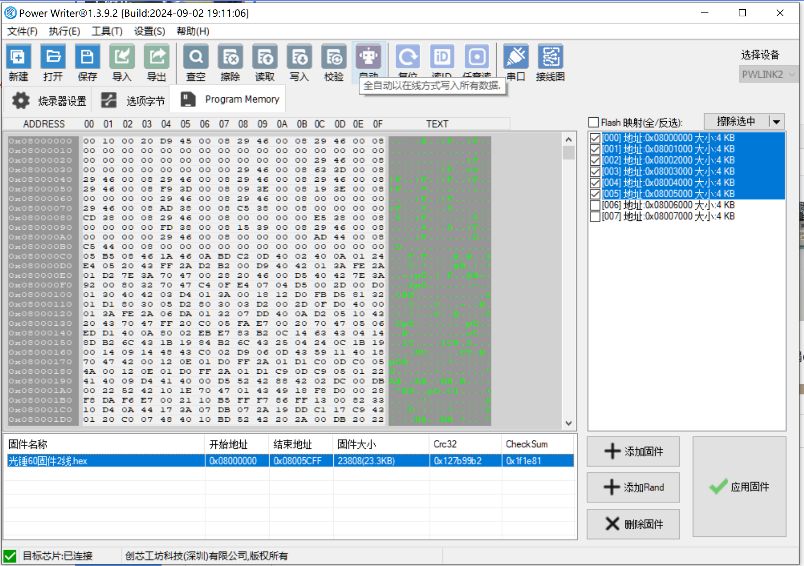 |

## Assembly Notes

1. Flash the mainboard firmware before final assembly.
2. Use 16 AWG silicone wire for the mainboard input and XT30 male connector.
3. Use 20 AWG silicone wire and GH1.25 2P cables on the LED board side.
4. Mount the 3010 fan to the heatsink, then modify the fan lead to GH1.25 2P if needed.
5. Connect the mainboard output, LED board input, temperature sensing line, and fan line before closing the structure.
6. Use M1.7 heat-set inserts for the lamp-head top cover and M1.4 heat-set inserts for the handle connection.
7. Center the protection board inside the handle battery pack.
8. Add foam around the battery pack output side to reduce vibration and compression risk.

| Mainboard input wiring | Fan installation | Fan connector modification |
| --- | --- | --- |
| 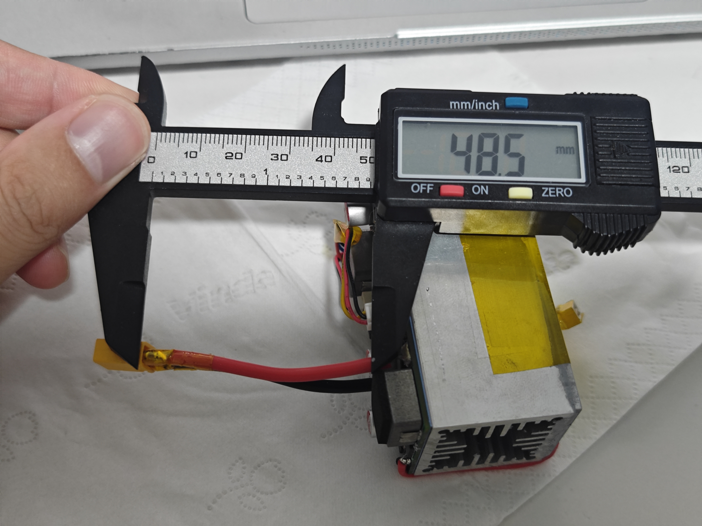 | 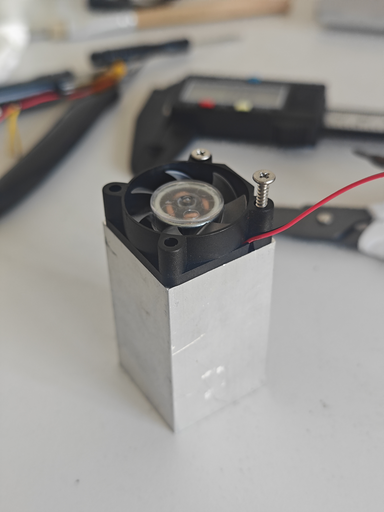 | 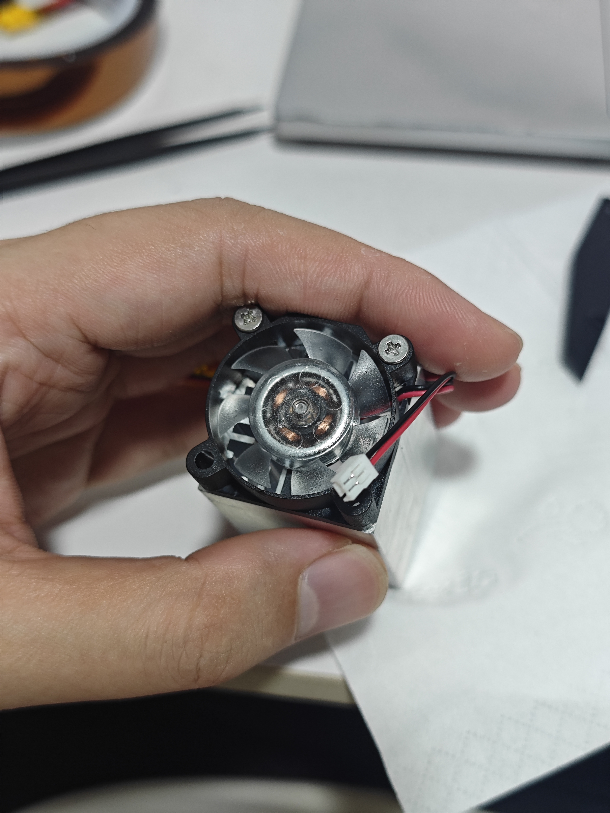 |

| Mainboard and LED board wiring | Battery pack installation |
| --- | --- |
| 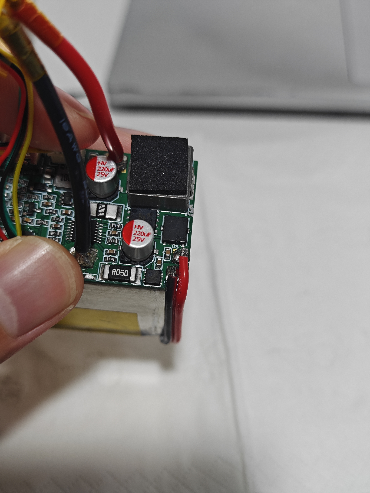 | 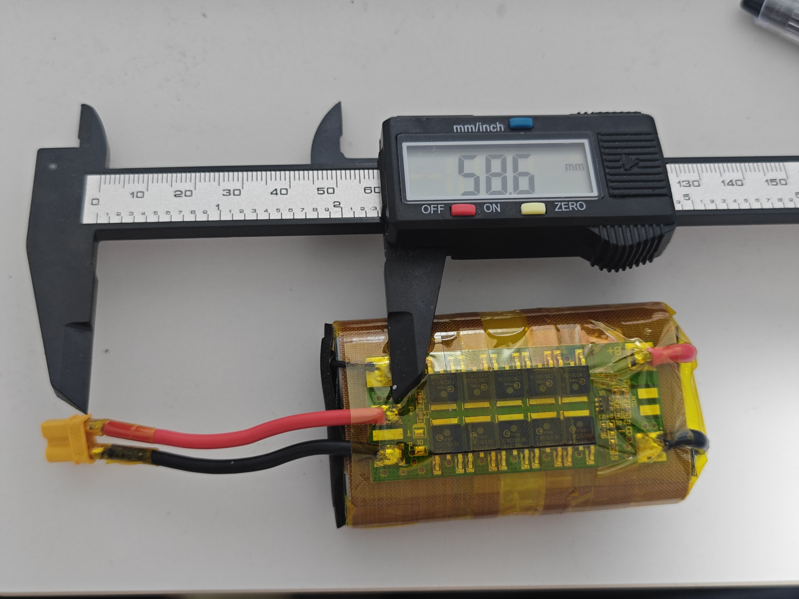 |

## Operation

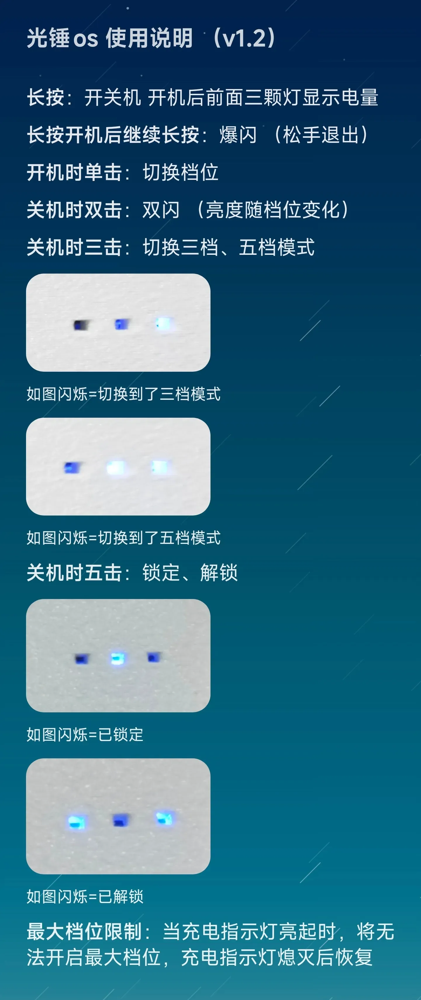

## Safety Notes

This is a high-power LED and lithium battery project. Build and test it carefully.

- Do not downgrade protection board, cell, wire, or connector specifications.
- Verify the thermal path before sustained high-power operation.
- Check polarity and programming probe orientation before flashing.
- Current-limit the first power-on test and monitor temperature.
- Do not leave the battery pack or high-power LED unattended during early testing.
- If shipping batteries internationally, use a logistics channel that supports lithium batteries.

## Repository Layout

```text
forge60-hardware-release/
  mainboard-v2/
    mainboard-v2-gerber.zip
    mainboard-v2-bom.xlsx
    mainboard-v2-bom.csv
    mainboard-v2-pick-and-place.xlsx
    mainboard-v2-pick-and-place.csv
    mainboard-v2-schematic.pdf
    mainboard-v2-pcb-preview.pdf
  led-board-5050/
    led-board-5050-gerber.zip
    led-board-5050-bom.xlsx
    led-board-5050-bom.csv
    led-board-5050-pick-and-place.xlsx
    led-board-5050-pick-and-place.csv
    led-board-5050-schematic.pdf
    led-board-5050-pcb-preview.pdf
  source/
    forge60-easyeda-pro-source.epro2
```

## License

This hardware project is released under the CERN Open Hardware Licence Version 2 - Permissive (`CERN-OHL-P-2.0`). Commercial use is allowed under the terms of the license.
